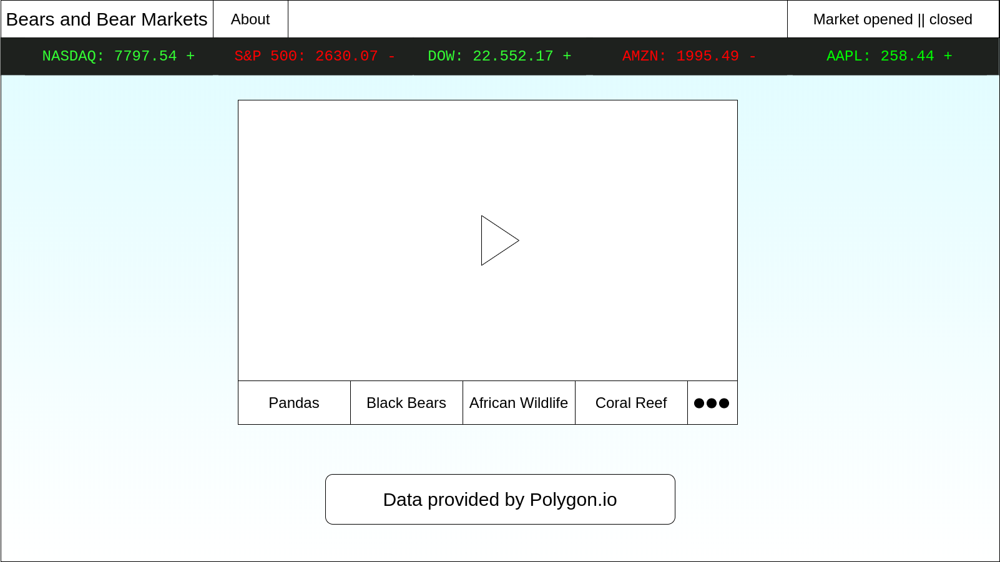
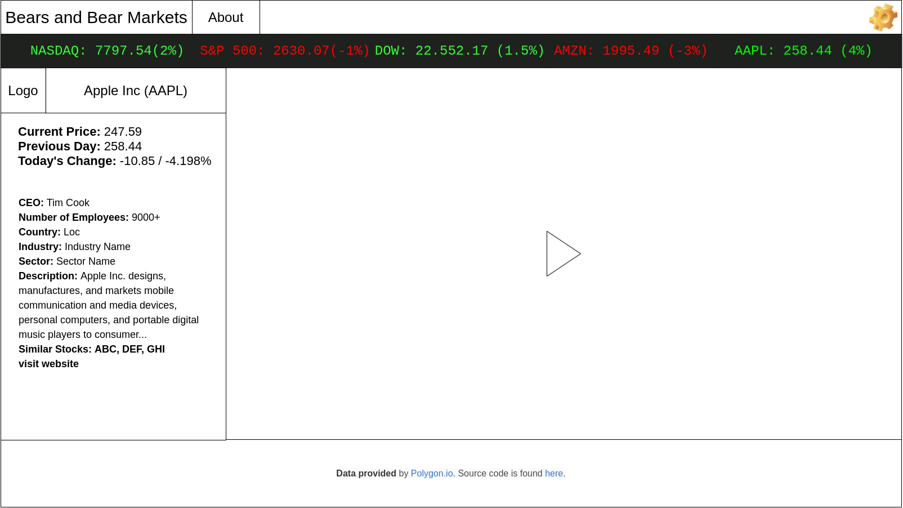
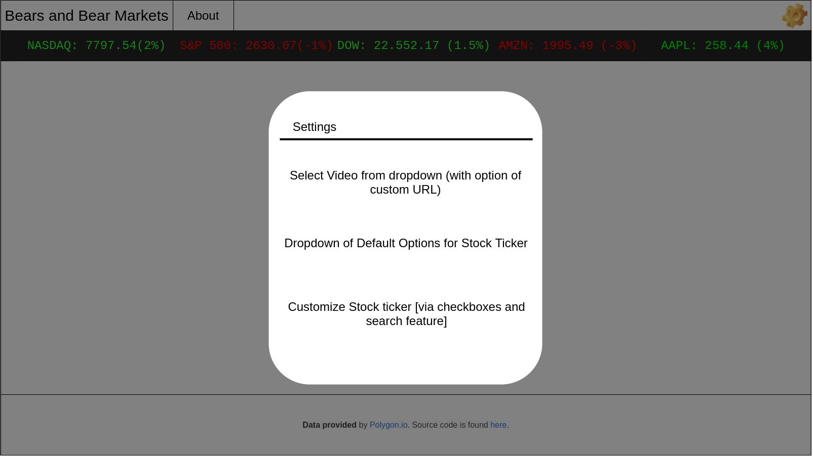

This project was bootstrapped with [Create React App](https://github.com/facebook/create-react-app).

# Bears and Bear Markets

## Purpose
At my previous company, people would regularly want to have the financial news or price of cryptocurrency up on the screen. I preferred relaxing or cute animal videos. I had the idea to combine these two things into a single screen that could be displayed on an additonal monitor or on a large TV in a common area.

## Mockups
### Default View

### On Click

When clicking a one of the items in the stock ticker, this view will appear; live video will keep playing
### Settings View

## Requirements
* ~~Display video player that displays live nature feed~~
* ~~Display of basic market info below header and above video player~~
* when clicked, component displays more information about stock or market; view shifts
* Settings to change video
* Settings to change stock tickers displayed
  * Dropdown of default settings
  * Cutomization via search and checkboxes
## Available Scripts

In the project directory, you can run:

### `npm run start`
### `npm run css-start` to set up sass
### `npm run build`
