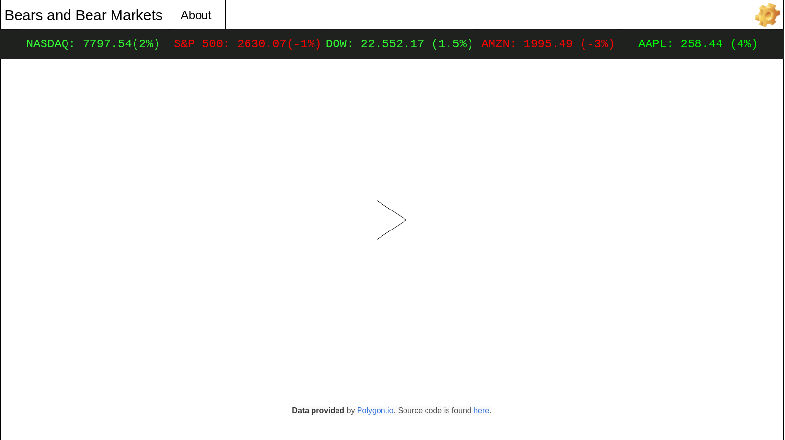

This project was bootstrapped with [Create React App](https://github.com/facebook/create-react-app).

# Bears and Bear Markets

## Mockup
### Default View

### On Click

When clicking a one of the items in the stock ticker, this view will appear; live video will keep playing

## Requirements
* Market Closed or Open in top right corner
* Display video player that displays live nature feed
* Display of basic market info below header and above video player
* when clicked, component displays more information about stock or market; view shifts
## Available Scripts

In the project directory, you can run:

### `npm start`

### `npm run build`